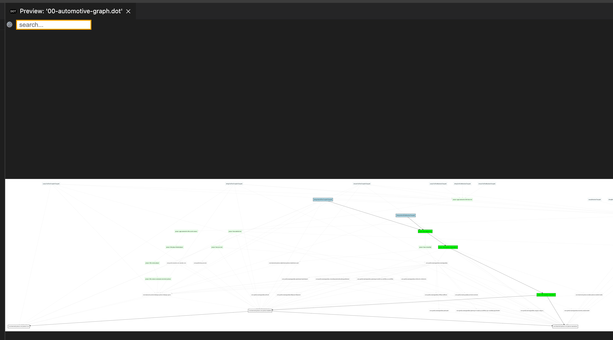

# Visualize Gradle Dependencies

- [Visualize Gradle Dependencies](#visualize-gradle-dependencies)
  - [Pre-requirements](#pre-requirements)
  - [Usage](#usage)
  - [Get Help](#get-help)
  - [Do analysis](#do-analysis)
  - [Troubleshooting](#troubleshooting)
    - [My VsCode configuration](#my-vscode-configuration)
    - [Apply NodeJs automatically on project folder entrance](#apply-nodejs-automatically-on-project-folder-entrance)



## Pre-requirements

```bash
# requirements
#
# Install NVM, latest node
#
curl -o- https://raw.githubusercontent.com/nvm-sh/nvm/master/install.sh | bash
nvm install --lts
nvm use --lts
#
# Install DirEnv
#
curl -sfL https://direnv.net/install.sh | bash
direnv allow
#
# Install Yarn
#
curl -s https://raw.githubusercontent.com/tophat/yvm/master/scripts/install.js | node
yvm list-remote
#
# Install GraphViz tool
#
brew install graphviz
#
# Install all required packages
#
cd dependencies.graphviz
direnv allow
yarn
``` 

## Usage

```bash
# collect project dependencies into file
# cd ~/src/android-project
./gradlew :project:app:dependencies | tee dependencies.log

# extract graph of dependencies from log file (com.fasterxml.jackson)
./index.dependencies.js dependencies.log --dot --simplify | tee jackson.dot

# extract graph of Moshi dependency usage (com.squareup.moshi:moshi)
./index.dependencies.js dependencies.log --dot --simplify --search com.squareup.moshi:moshi | tee moshi.dot

# convert graph to image
dot jackson.dot -Tpdf -o jackson.pdf
dot jackson.dot -Tsvg -o jackson.svg
dot jackson.dot -Tpng -o jackson.png
```

## Get Help

```bash
./index.dependencies.js --help 
```

Output:

```text
Usage: index.dependencies.js gradle_dependencies_log

Options:
      --version   Show version number                                  [boolean]
  -s, --search                                [default: "com.fasterxml.jackson"]
      --help      Show help                                            [boolean]
  -v, --verbose   Publish debug information                            [boolean]
  -d, --dot       Print GraphViz dot graph instead                     [boolean]
  -i, --simplify  Remove version information from dependencies         [boolean]

```

## Do analysis

Install vsCode. `brew cask install visual-studio-code`

```bash
code --install-extension joaompinto.vscode-graphviz
code --install-extension vscode-interactive-graphviz
```

Open VsCode and inside it open `.dot` file. `Cmd+Shift+A` type: `Graphviz` and select `Graphviz Interactive: preview`.

On graph node click you will see a selected path.


## Troubleshooting 

### My VsCode configuration

```bash
# code --list-extensions

bierner.markdown-mermaid
codezombiech.gitignore
dbaeumer.vscode-eslint
EditorConfig.EditorConfig
esbenp.prettier-vscode
joaompinto.vscode-graphviz
k--kato.intellij-idea-keybindings
tintinweb.graphviz-interactive-preview
yzhang.markdown-all-in-one
```

### Apply NodeJs automatically on project folder entrance

```bash
# create extension file
touch ~/.direnvrc

#
# register new method in .diremvrc
#
echo "" >>~/.direnvrc
echo "use_nodejs() {" >>~/.direnvrc
echo "    NODE_VERSION=\"\$1\"" >>~/.direnvrc
echo "    type nvm >/dev/null 2>&1 || . ~/.nvm/nvm.sh" >>~/.direnvrc
echo "    nvm use \"\$NODE_VERSION\"" >>~/.direnvrc
echo "}" >>~/.direnvrc
echo "" >>~/.direnvrc

# apply method call
echo "use nodejs" >>.envrc

# re-enable direnv for folder after changes
direnv allow
```

refs:

- <http://blog.differentpla.net/blog/2019/01/30/nvm-direnv/>
